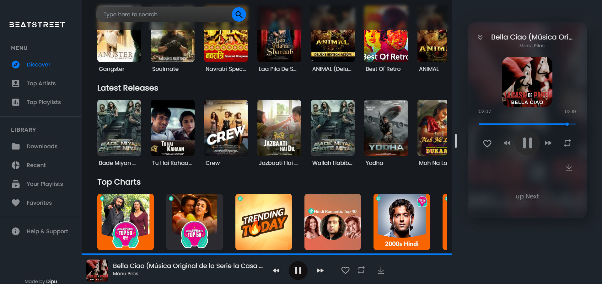
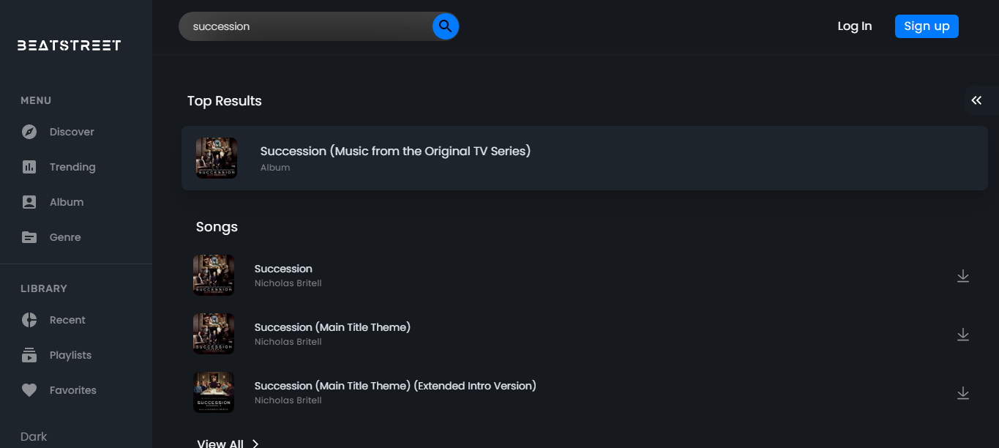
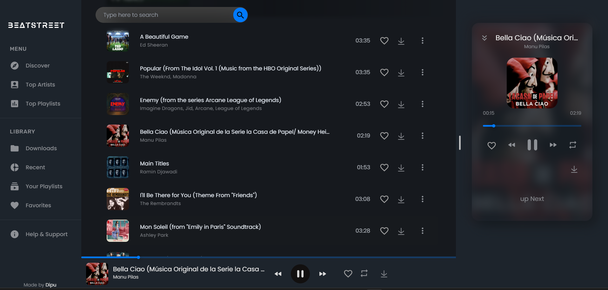
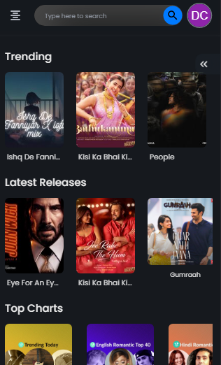
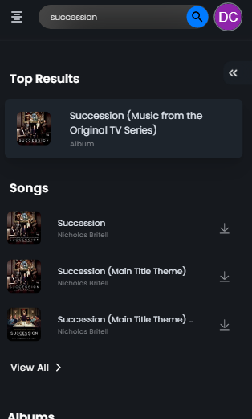
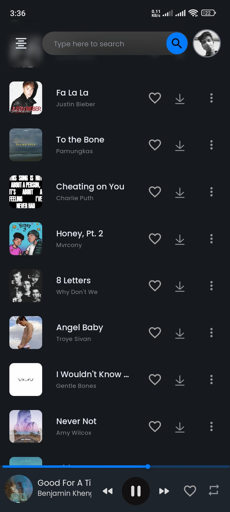

# Beatstreet

Welcome to Beatstreet, a free website where you can listen to your favorite music anytime, anywhere. This website has been developed using the MERN stack, which stands for MongoDB, Express, React, and Node.js.

## Features

- Can be installed as a PWA on your PC or Mobile.
- Listen to your favorite music for free
- Search for your favorite artists, albums, and songs
- Create and manage playlists
- Download songs for offline listening
- No Subscription
- No Ads

## Technologies Used

- MongoDB - for the database
- Express - for the backend API
- React - for the frontend UI
- Node.js - for the server
- ReactQuery - for fetching data from the backend
- Redux - for state management
- Material-UI - for the UI components
- Netlify - for hosting the website
- HTML, CSS, and JavaScript - for the website design and functionality

## Getting Started

To use the Music Streaming Website, simply click on the following link: [Beatstreet](https://beatstreet.netlify.app/)

## Screenshots

### Desktop View

#### Homepage

#### Search Results

#### Playlist

### Mobile View

#### Homepage

#### Search Results

#### Playlist

